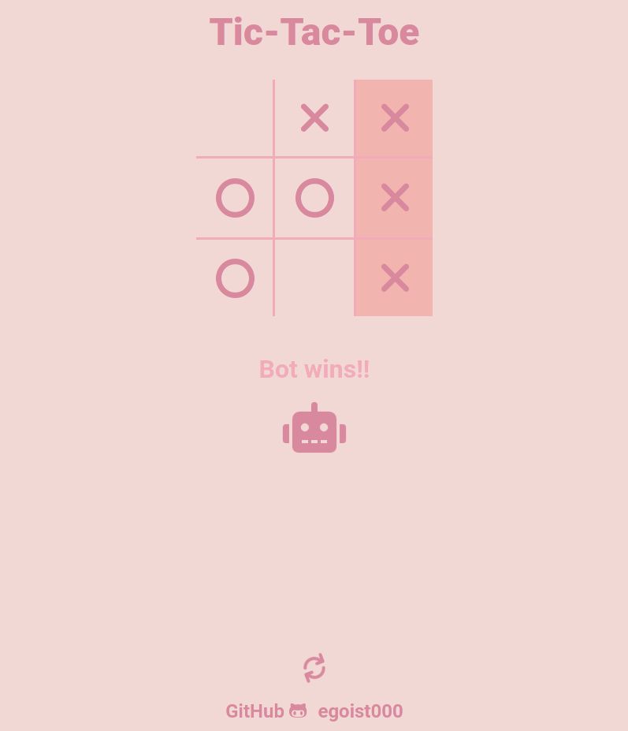

# tic-tac-toe
tic tac toe [game](https://egoist000.github.io/tic-tac-toe/) in js with 4 difficulties:
1. Easy (random move)
2. Normal (minimax algorithm with a precision of 75%)
3. Hard (minimax algorithm with a precision of 90%)
4. Impossible (you only tie or lose)

## Screenshots
### Start

### Play

### Lose

